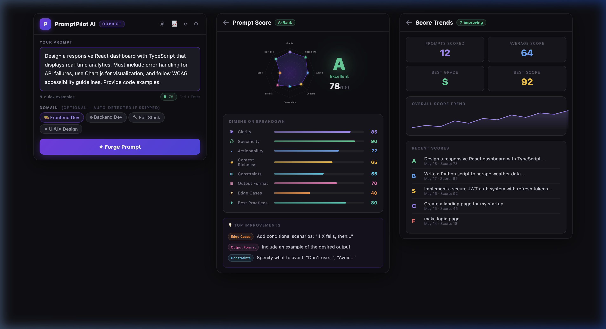

## Description

Implements the **📈 Prompt Scoring Engine** from the project roadmap — a client-side scoring system that analyzes prompts across **8 dimensions** with animated visualizations, letter grades, and actionable improvement tips. Zero additional API calls needed.

### What's New

**Scoring Engine** (`src/scoring/`)
- `PromptScorer.js` — Analyzes prompts across 8 dimensions: Clarity, Specificity, Actionability, Context Richness, Constraints, Output Format, Edge Cases, and Best Practices
- `ScoreHistory.js` — Persistent score tracking using `chrome.storage.local` with trend analysis and personal bests

**UI Components** (`src/components/`)
- `ScorePanel.jsx` — Full scoring dashboard with:
  - Animated **canvas radar chart** (8-axis polygon with gradient fills)
  - **Letter grade system** (S/A/B/C/D/F) with glow effects
  - Expandable dimension breakdown with per-dimension progress bars
  - Contextual improvement tips sorted by weakest dimension
  - Before/after score comparison after enhancement
- `ScoreTrends.jsx` — History dashboard with:
  - Session stats cards (prompts scored, average, personal best)
  - Overall + per-dimension sparkline trend charts
  - Recent score history with grade badges

**App Integration** (`src/App.jsx`)
- Real-time `MiniScoreBadge` appears below the textarea as you type (shows live grade)
- Click the badge → opens detailed score dashboard
- `📈` button in topbar → opens Score Trends screen
- Scores auto-saved to history after each enhancement

### Screenshots

**Left Panel**: Main app with live **Mini Score Badge** (A 78) below the textarea  
**Center Panel**: Full **Score Dashboard** — radar chart, A-grade badge, 8-dimension breakdown, improvement tips  
**Right Panel**: **Score Trends** — stats cards, sparkline trend, recent score history (F→S progression)

## Type of Change
- [ ] Bug fix
- [x] New feature
- [ ] Documentation update
- [ ] Refactor

## Testing Done
- ✅ `npm run build` — Passes (571ms, 40 modules)
- ✅ `npm run lint` — All new code passes (only pre-existing `background.js:200` issue)
- ✅ Bundle size impact: +20 bytes gzipped (207.74 → 207.76 kB)
- ✅ Verified scoring algorithm with various prompt types (vague → detailed)

## Checklist
- [x] Build passes successfully
- [x] Documentation updated if required
- [x] Tested in Chrome
- [x] Code follows project guidelines
