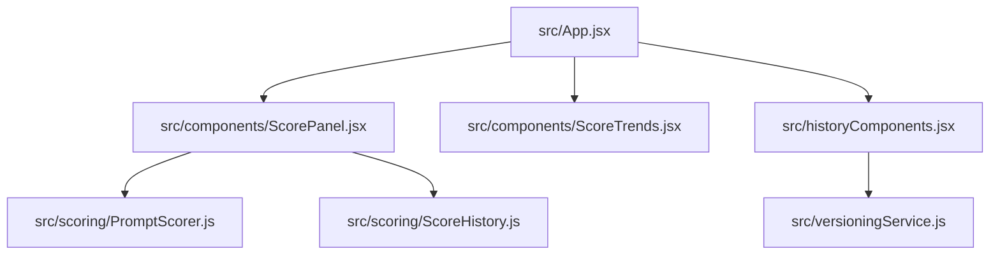

# Architecture Overview — PromptPilot AI

PromptPilot AI is built as a lightweight, privacy-focused, offline-first Chrome Extension designed to improve and score LLM prompts.

## Key Design Principles
1. **Zero External Calls for Scoring**: Prompt evaluation and grading run entirely client-side using heuristics and word dictionaries.
2. **Local Storage Persistence**: Version history and score trends are saved locally via `chrome.storage.local`.
3. **Clean Separation of Concerns**: Logic is isolated into distinct domains.

## Component Overview

- **PromptScorer**: Evaluates prompts across 8 dimensions: Clarity, Specificity, Actionability, Context Richness, Constraints, Output Format, Edge Cases, and Best Practices.
- **ScoreHistory**: Handles local saving of score trends, best scores, and stats.
- **versioningService**: Manages the version history database (creating, updating, deleting, restoring versions, and backup import/export).
